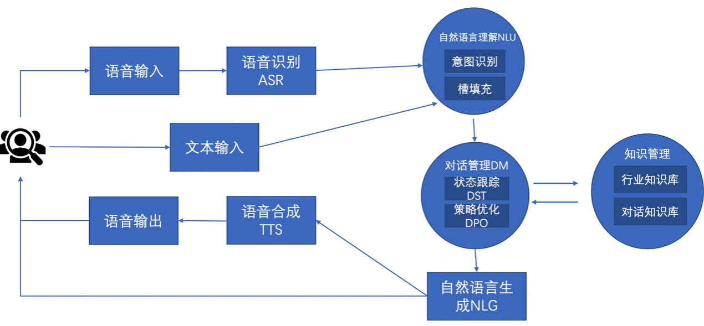

# NLP的第一步——NLU

在对话系统中，智能体接收来自人类的自然语言指令，然后将其通过NLU模块转换成可理解的任务配置，再完成任务，最后返回反馈。NLU便是这个HCI过程的第一步。NLU包含两部分：意图识别和槽填充。具体来讲，意图识别是识别出这句话的任务是什么，任务往往是预定义。在预定义的意图下，有一些这个任务必须包含的信息，即槽，NLU还需要将所有槽都填充好。若一句话无法完成，则需要多次问询来填充所有槽。填充好后就算完全理解了这句NL。NLU的结果就是更新对话状态，即更新DST的内容。对话状态追踪的内容是一个三元组（domain, slot, slot value）

在NLU领域的所有工作，可分为三类：

+ ID 意图识别：主要是聚焦于句子的分类问题，如使用CNN、LSTM
+ SF 槽填充：大多使用反事实学习CRF、RNN和其他基于RNN的模型做每个槽的分类
+ 二者的混合模型

意图识别：

1. 微软2013 开发了一个ID和SF的混合系统，能通过意图识别的结果指导slot的生成，使用CRF和神经网络的混合模型
2. 微软研究院和UCB 2015，第一次将RNN 和 LSTM引入意图识别，分类出合适的意图。

槽填充：

1. 微软研究院 2013年 经典的RNN-LM通过一层隐藏层学习预测标签序列（其实这个时候距离原始的条件随机场已经很远了）。本文提出，在原始的RNN基础之上，添加一些trick，比如输入的不是当前词汇，而是当前+下一个词汇，并在隐藏层和输出层的输入中添加第t个词后面的所有词汇。原因是：槽填充是将一句话中的关键词挑出来，但不应该限制时序问题，一句话中通过后文预测关键词是很合理的。
2. 微软研究院 蒙特利尔大学 鲁汶大学 2013年 实现了两种RNN的变体来实现槽填充任务，发现比传统条件随机场的结果好，且双向循环网络的效果也很好（预测槽序列还包含过去和未来的）
3. 微软研究院 2014年 使用LSTM做SF任务
4. 微软研究院 2014年 使用Elman, Jordan型RNN和双向RNN尝试完成SF任务，发现效果还不错，双向RNN整合一句话的上下文，对SF的准确率更高
5. 微软研究院+北航 2014年 循环CRF算法。循环神经网络逐个输出每个词对应的槽的概率，CRF对于一个句子计算整体的slot序列的联合概率。CRF的输入是句子，输出slot联合概率分布序列。将RNN和CRF结合，用RNN的输出作为CRF的输入，并同时提出两种：普通RNN和jordan类型的RNN。结果还不错。
6. 德国斯图加特大学 2016年 使用双向RNN学习slot标签，并使用排名loss进行训练。排名loss的特点是：除了交叉熵具有的特点之外，还需要最大限度拉开错误类别得分上界和正确类别得分之间的差距直到到达固定阈值（如预定义正确类别的得分比错误类别得分的上界应该还高10，则训练到满足这个条件才算训练出来这个loss）https://chatgpt.com/share/66e7d300-7338-800a-aec8-65be5fff58f1
7. IBM 2016年 使用encoder-decoder方法输出预测的slot序列，一个句子输入lstm，输出中间层隐变量，下一个lstm再将该隐藏层作为输入，输出slot序列

意图识别与槽填充的联合训练模型——隐式

对于隐式的联合模型，说白了就是神经网络伸出两个头

1. 北大 IJCAI 2016 一个神经网络，输入一句话，输出slot序列和intent的预测。输入首先进行embedding，然后联合上下文的word输入双向循环GRU，再分别通过MLP和maxpooling输出slot和intent。slot的loss函数反应的是每个位置上label的转移概率；intent的loss函数是交叉熵。总的loss函数是二者的加权和。
2. 使用基于注意力机制的id和sf生成。其中使用编码-解码器架构。句子输入双向lstm模型，lstm模型的输出和注意力机制的context vector一起输入中间态模块，中间模块输出slot的预测和隐变量，隐变量通过mean-pooling输出id预测
3. CMU 2016年 之前的工作中，往往是首先输入一句话，然后对这句话判断意图、sf等。在本文提出的网络结构中，在rnn的每个节点上都伸出两个头，分别是当前的slot预测和目前为止的intent预测。然后slot预测再参与下一个节点进行预测。节点的输出用来对语言进行建模。因此，整个网络可以在说话的过程中同时进行：语言建模、意图识别和槽填充工作。loss函数是三个交叉熵的加权平均。
4. 改进不大

意图识别与槽填充的联合训练模型——显式

对于显式的联合训练模型，除了一起训练之外，还探究意图和槽之间的指导和相互关系

1. 台大2018年 在输出slot排序之前，加入一个slot gate组件，这个组件输出一个向量，该向量对slot的context vector作重新分配，组件的输入是slot和intent的context vector，其中intent的context vector的权重是可学习的。因此，intent的结果能够影响对slot序列的预测，让其更合理。
2. 金山软件2018 核心还是双向LSTM RNN输入之前套一层embedding和一层自注意力机制 RNN输出一个intent估计，intent再经过门控机制和LSTM的其他输入一起输出slot估计。如果要讲可以讲这个
3. 哈工大 2018 首先将语句embedding，然后自注意力机制+lstm。首先，对应每一个intent标签，都输出一个token，作为这句话属于这个意图的概率分布，然后每个概率分布再和隐变量一起参与训练输出slot分布。这样的好处是得到更准确的slot分布。
4. 哈工大 2021 对intent和slot任务的双向辅助进行建模。不仅仅intent的结果能够增益slot，反过来也可以。首先对输入的句子使用双向LSTM提取特征，然后分别进行自注意力提取成intent和slot，然后使用QKV相互交叉，完全对称的学习对方的特征，最后归一化再decoder。

---

我最开始做的事多智能体系统的通信方法方面的综述。整个综述分为两个部分：智能体系统的通信、人与智能体通信。二者的区别自然是是否有人参与。

对于所有智能体系统的通信方法这一板块，我找到了两种分类方法：what（发什么，即通信的内容是什么）和who（发给谁，即如何限定发送的对象）。

对于前者，通信的内容分为两类。第一种是智能体之间使用一些已经有定义的内容作为通信的内容，如智能体的observation，action等；第二种是智能体之间使用某种通信管道进行通信，换句话说，智能体发送和接收的信息是可学习的。

对于后者，通信的对象分三类：第一种，智能体系统构造一个模块，在学习策略、信息等内容的同时也学习发送信息的对象，第二种，智能体正常学习策略并发送信息，但在发送之前通过门控单元控制发送和接收信息的对象，这个门控单元由智能体控制或统一控制，第三种就是所有智能体都参与通信，无关通信对象。

对于人机通信方法这一板块，我也将这个类别的方法分为了两类：一对一的人机通信和一对多的人机通信。

对于一对一的人机通信，也就是对话系统，分为四个阶段：NLU（自然语言理解）、多轮对话的对话状态追踪、策略更新和生成（自然语言生成或其他内容的生成，如动作序列的生成）。

对于一对多的人机通信，首先，智能体和上文所述一致，已经拥有了在智能体系统中通信的能力，这个部分主要考虑人类如何加入智能体系统的通信。这部分分两类，第一类是：智能体系统自己已经形成了通信，人类通过一个“翻译器”组件加入通信；第二类是：智能体干脆从最开始就是使用人类定义的结构化语言或者人类能够理解的语料库学习出的通信方法，人类可以无痛直接加入通信。

这是我到目前为止完成的全部工作，而我有这些问题希望与你讨论：

首先，对于一对一的人机交互方面，这似乎属于NLP领域，我之前一直在做的是强化学习的基础知识，对这方面并不熟悉，你认为对对话系统研究是否已经涵盖了一对一人及通信的全部部分？如果没有完全涵盖，请你补充；如果完全涵盖了，请你告诉我。

第二个问题，这所有的方面的文献，我都没有发现和大语言模型的关系。考虑到大语言模型最近已经做出了很好的工作，我希望我的综述中能够有大语言模型的一席之地，请你考虑一下这件事。

当你回答完这个问题，我会告诉你13号我和导师交流这个框架后我的导师让我补充什么内容。请你一定要认真思考我和你说的话，这关系到我对我的研究生活的信心。
