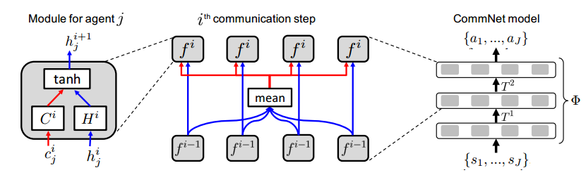
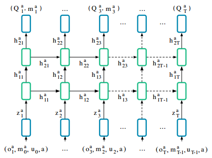
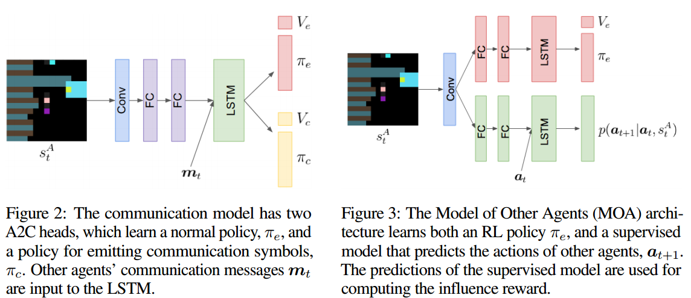

1. 最开始，人们让智能体在一起训练，使得他们从空白开始学习一个通信协议出来。相关引文如下：

   + 引文序号24。2016年，deepmind，DDRQN算法，首次提出智能体团队自主学习通信协议的工作。所有智能体放在一个网络中，共享所有参数。训练的Q函数形式为：$Q(o_t^m,h_{t-1}^m,m,a_{t-1}^m,a_t^m;\theta_i)$，m是智能体的编号，由观察、隐变量、编号和上一轮的动作参与下一轮的动作选择。本工作有三个亮点：使用时序网络、共享权重（所有智能体在一个网络中选择动作）、禁用经验回访。通信的部分表现在将智能体编号共享了（共享参数也是一种通信）。属于类别2.2
   + intro序号25，引文序号47。NIPS 2016 纽约大学 CommNet，使用反向传播学习通信的全连接网络。此前的工作，如机器人足球，使用固定的信息共享进行交流，如直接将信息发送给其他智能体，辅助进行RL训练。本文结构是这样的：整个模块输入所有智能体（J个智能体）的状态，输出所有智能体的动作，目的是优化一个共同的目标。在模块中，总共通信K轮。每一轮，对J个小模块，输入通信信息C和上阶段隐状态h，其中h完全照搬上一通信轮次的输出，C是所有其他智能体上一阶段输出的均值，输出本阶段该智能体的隐状态h。训练的结果是得到一个模型，输入队伍所有人的观察，输出所有人的动作。属于类别2.2。
   + intro序号27，引文序号12。2016年，牛津大学和google deepmind。RIAL和DIAL模型。作者认为，多智能体系统中的通信是必然存在的，环境是部分可观察的，通信信道在训练过程中是无限的在执行过程中是带宽有限的，每个智能体是想合力解决一个奖励目标的优化的。本文从零开始学习智能体通信的协议，整体智能体采用中心化学习分布式执行的架构。RIAL：两个网络，第一个独立Q学习（independence Q-learning），每个agent的Q网络单独训练，把其他agent视作环境，第二个网络在所有agent之间共享参数。RIAL主要解决部分可观察环境的问题。DIAL：同样是对中心化训练的修改。原有的中心化训练网络无法在agent之间传递reward消息的梯度，无法针对这一块进行训练。DIAL可以将梯度在agent之间传递，解决了这个问题。所谓通信协议，就是输入环境、动作和其他智能体的信息等信息，在输出当前智能体的消息message。RIAL中，每个智能体动作选择器之前加一个Q-net模块，输出动作和message两个的Q函数，发送给动作选择器。动作选择器再计算出合适的u和m发送给其他智能体或环境。在DIAL中，每个智能体动作选择器只负责选择动作，C-net负责输出message并使用DGU回传message的梯度。这个输出message的模块就是协议本身。每个智能体的结构如图：

2. 但是这种方式使得代理在和同伴配对时才获得比较高的价值

   + 序号21，2017年CMU等机构，探究多智能体的通信过程中出现的可解释的自然语言不是自然而然地出现的。尽管agents可以从零开始构建语言协议，但是语言协议不是完备的，可以找到一些方法构建完备的语言协议。希望本工作对多智能体开发出更具解释性的语言提供帮助。属于2.2
   + 序号14，2019年纽约大学等机构，开发了一个多智能体通信的框架，进行语言学的分析，得出结论为，智能体本身不具备复杂的语言能力的情况下，一样会形成复杂的语言现象（如语言相互理解、其他语言灭绝、语言产生连续体并和智能体拓扑结构相关）。该文章是完全语言学文章，日后深入研究语言学知识后可用，偏向于2。
   + 序号23，ICLR 2018 deepmind，使用像素输入的REFERENTIAL GAMES验证了，当输入agent社区的数据越结构化，生成的通信协议越自然。本文研究更关注环境如何影响agent学习协议的性能。属于2。从结论能看出来，若输入agent训练的环境数据以结构化的形式（如向量），那么形成的通信协议也能发现这个结构；如果输入agent的数据和人类差不多，是原始数据，那么形成组合协议的能力受到影响

3. 有些证据表明，这些agent没有学到通用的技巧，而是完全特殊约定的技巧。

   + 序号31，2019年，第一作者麦吉尔大学，之前的多智能体通信系统在系统中添加通信信道然后观察累计回报的变化，这样的metric很难衡量通信算法是否真的优秀。本文开发了新的metric。属于类别1. 文章指出，之前的metric常常观察智能体积极的去发送信号，而没有对于聆听信号表现出积极性。本文提出的metric能够衡量智能体的聆听信号的积极性。文章认为，通信分两步：首先，一个智能体产生信号，这个信号与该智能体的动作或者observation有关；其次，另一个智能体在观察这个信号之后，能更新自己的行为或者信念。positive signaling属于前者，positive listening属于后者。常见的通信指标包括：

     + reward
     + 可解释性的通信：一些简单的谜语游戏，开发者可以尝试解释智能体之间在进行的通信是什么意思。
     + speaker一致性：开发者将speaker所说的话（对自己动作的描述）和所做的事进行对齐，作为通信reward的一部分。
     + 上下文独立性（Context independence）：该指标用来衡量agent在通信过程中是否使用了一个特殊的表达（比如符号）来表示一个特殊的概念。
     + 信息分布的熵：该指标是指同一个智能体，对于不同输入输出的信息的熵。对于不同的输入，输出的熵理应是不一样的。但是该指标没那么有用
     + 瞬时协调（Instantaneous coordination）：计算的是一个智能体的信息和另一个智能体的动作之间的交叉熵。该指标衡量的事听的怎样
     + 本文的方法——交流的因果影响（causal influence of communication，CIC）：衡量的是一个智能体的信息对另一个智能体的下一个动作的因果影响。从计算上来讲，计算的是message和action的一种互信息。

     本文有价值的引文：

     + 关于agents之间的通信翻译成人类理解的：序号2.UCB 2018年，本文提出一种算法，能够构建一种模型，将输入的神经语言（neuralese messages，可能以vector的形式存在）翻译为人类理解的自然语言。属于2.2（此文很好，值得再次阅读并阅读引文）翻译的训练方式是：基于语言对agent的信念的变化，若神经语言和自然语言表达的是同一个东西，那么两个语言对智能体的**信念**的变化是一致的。具体训练的loss可以是自然语言和神经语言对智能体分布变化之间的kl散度。**信念就是指，听者听到话之后，对于说者所处世界观的构建**。一般以分布的形式呈现。https://chatgpt.com/share/9a97d43d-d915-41aa-a259-d62515799107

     + 关于通信中的因果推断：序号21。ICLR 2019，使用反事实学习训练agent对其他智能体动作的因果推断。首先本智能体先预采取一个动作，然后估计该动作对其他智能体的影响，将这里的值作为reward的一部分。这个reward除了用来更新策略之外，还用来训练通信管道的使用，刺激所有智能体使用通信管道，这个通信管道类似于RIAL，收集所有的信息，结合state和reward来训练一个输出message的模型。之前进行反事实推断时使用的是中心化智能体的网络；但是不合理，本文使用因果推断reward构造MOA模型，推断其他agent的下一步动作，进而更准确计算因果推断reward。这个因果推断指标能够刺激智能体通过通信管道发送有用的信息。属于类别2.1.https://chatgpt.com/share/c43b443d-f197-4998-9923-d54e87c1406c

       

     + （序号2的引文，Towards multi-agent communication-based language learning）这篇文章是一个典型的二人指认游戏的通信。A1看见物品后编码一个指认信息向量，发送给A2；A2通过对比这个指认信息向量和物品的相似度来选择物品。这个指认信息向量就是通信协议。属于类别2.1

4. Compositionality and Generalization in Emergent Languages。meta AI 2020，研究生成语言的组合性和泛化性。本文实验表明，首先，如果数据规模足够大，所产生的语言一定是具有组合性的；其次，组合性并不意味着一定具有很强的泛化性；第三，组合性虽然不意味着泛化性，但组合性语言的好处是组合性越强，学习者越容易学会这个语言。https://chatgpt.com/share/d6ab442e-cb6f-4f83-bb07-0bbadc9ad623.

5. 