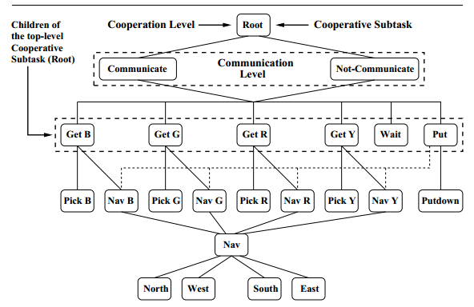

1. 自动化所，解决大规模baseLLM的agent的决策制定，其中agent的数目不固定。为了解决合作问题。使用AC框架，中心化critic，分布式actor

2. natural language-based reinforcement learning，引入task language概念，将nl翻译为agent能够理解的tl，然后执行，并且具备tl生成的模块

3. 腾讯AIlab，训练新的联盟学习玩星际，使得智能体有目的性的挖掘自身联盟的弱点（在星际中，不完全或不完美信息可以被侦察出来，与麻将不同），并激励智能体更倾向于侦察，通过更少的资源训练更好的AI。

4. ICML2021，COPA算法，教练带球员，1)对教练和球员都采用注意机制;2)提出一个变分目标来规范学习;3)设计一种自适应的沟通方式，让教练决定何时与球员沟通。motivation：协调成员动态变化的队伍。

5. 腾讯AI Lab，训练以人为本的智能体和人类组成的多智能体系统。（**或许可以结合偏好强化学习**）motivation：以自己为中心的智能体只能和人类一起走向胜利，但不能以人类为中心。例如都是打王者胜利，但ai抢人类人头会让人类玩家不爽。这里加上了“以人类为中心”的增强。方法：首先人类根据自己的目标创建表现，称为“baseline”；训练value网络来评估人类玩家达到目标得到的return。其次训练gain网络评估agent以人为本为人类带来的积极gain，最后根据agent产生的积极性gain对agent微调。

6. 新加坡NUS，FRL框架。motivation：rl面临训练样本量不足且没法分享的问题，frl可以使得rl智能体相互分享轨迹，增强学习成功的可能性。该文章提出的框架解决了FRL收敛性分析和系统容错率（容错率包括agent随机故障和可能的攻击）问题。

7. Deepmind，RLHF。motivation：在没有程序化奖励模型的基础上训练agent。由人类的偏好指导agent的训练方向。方法：基于模仿学习baseline，通过人类偏好训练建立reward model

8. 人大高瓴，LLM-based HAC，motivation：提出一种基于LLM的与人类进行协作的智能体，并且该智能体能够判断什么时候该让人类介入。人类把握大方向，agent实现子领域。

9. 清华，zero-shot cooperation assume human bias。motivation：已有的zero-shot不需要人类数据就能训练出MARL的agent，但是这种训练只是根据环境reward建模，人类的偏好和环境的reward model不一致。本文借助人类偏见（bias），生成一个有效的策略池。（之前为了防止self-play进入过拟合，多个智能体一起训练形成一个策略池，然后智能体针对策略池自适应调整，预防进入次优）方法：在第一阶段构造策略池时就将隐藏的人类回报放入。

10. US Army，测量MARL系统中多智能体协作的质量。方法：提出一种指标CCM，将智能体的一段行为视为时间序列，然后embedding。embedding之间的影响就是多智能体协作质量的指标。

11. MIT，motivation：研发一个框架，将人类和ai的行为对齐，有助于生成式ai的发展。方法：放弃使用传统的state和action，而是使用更高级的task、行为流形behavioral manifold。通过完成task、比较人机行为来对齐。本质上还是训练期就人机交互。

12. 弗吉尼亚大学，开发对MARL的解释性框架，让人类理解MARL系统的策略。方法：将策略罗列出来；根据人类的自然语言问询来过滤出人类想查询的具体策略，并给出。

13. 微软研究院与滑铁卢大学，motivation：以人类为中心的AI在合作时接受人类的自然语言指示，AI根据这些问题理解、提问澄清和执行。

    ---

14. 清华与腾讯ai，motivation：zero-shot AI与没见过的人类合作。对于新的种群中，智能体个体多样性和结对（pairwise）多样性，提出一个种群熵优化目标，增强多智能体学习水平，使得训练出的智能体和未知的人类合作

15. UCB, AvE, motivation：AI协助人类时，经常需要推测人类的目标，可能导致推测不准，或者哪怕推测准了也不知道该帮助人类到什么程度。在本文中，提出了一种empowerment的度量。AI不需要推测人类的目标，只需要通过协助人类，使得人类在该环境下变得更强就行了。empowerment负责衡量人类是否变得更强。本文提出三个贡献：通过empowerment形式化建模AI对人类的协助、与“目标推测”相比较、提出一种empowerment的加速计算方法。

16. DeepMind，开发Fictitious co-play算法。motivation：AI与人类合作的时候，往往self-play无法学到与novel的人类合作。FCP算法基于self-play，在每次self-play训练的时候，通过随机化神经网络的参数使得agent获得随机性，再给游戏过程打上断点。最后训练一个agent，在这些断点处打赢所有的随机化agent。以此来模仿novel的人类。

17. Deepmind，开发基于种群和meta-learning的协议学习。在此之前，ai可以和之前遇见过的ai合作，但是无法和没遇见过的相互沟通。在之前的工作中，ai之间构造种群，在种群相互接触合作的过程中学习通信协议。但是这种方式只能学到专用的语言协议，无法通过自然语言和人类交流，因此在前人的基础上开发动态种群+meta-learning，增强广泛的适用度。（该文章的引文有需要看的）

18. Openai 2018年，开发一种环境，所有AI通过一种自创的简单符号逻辑语言作为合作的媒介，最后发现他们成功从中找到了规律并且能用其交流，从经验中抽象出组合语言且没有人类数据的帮助，在语言不足的时候还会引入动作补充。输出就是这个MARL的环境和实验结果。

19. MIT，比较了一下人类和rule-based和learning-based的AI合作，验证了人类更倾向于和rule-based的AI合作（由于舒适度等原因）。

20. DeepMind, AlphaStar

21. 腾讯AI Lab，对于MOBA游戏中的AI，微观的策略可以很好的学习，但是宏观的策略不好学。本文开发了分层的宏观策略学习方法，通过监督学习游戏回放的方式（去年12月的论文用过）。整体论文模型分为两部分：parse和attention。前者负责识别当前进行到了游戏的哪个阶段，后者结合游戏当前的阶段，对某种指令进行注意力机制。比如在游戏前期，应该更关注当前兵线。

22. 2018年deepmind，基于种群的方法训练CTF游戏的AI。使得AI不仅能够对固定地图做反应，还能随着地图和队友的变化而改进自己。基于种群的思路，AI跟着种群一起进化，在种群间采用self-play。AI进化出内部奖励模型。

23. 2021年，腾讯AI lab，MGG系统，解决MOBA游戏中策略多样性不足的问题。Macro-Goals guide，该系统首先根据游戏信息建模宏观策略，然后使用高水平玩家的游戏回放对宏观策略进行监督学习，使得AI知道根据自己的阵容、英雄等信息选择不同的策略。具体实现：首先使用当前状态s和macro-goal进行监督学习，得到meta-controller，用来产生macro-goal；使用训练好的meta-controller和得到的macro-goal进行PPO训练，学习到policy。macro-goal怎样得到：macro-goal分为：去哪里和做什么，在某一时刻，通过游戏回放的未来时刻来得到当前时刻去哪里和做什么。

24. 2020年，南洋理工大学，IMAC系统。本文分为两部分：首先证明了当通信带宽有限时，智能体发送信息的信息熵越低越好，即带宽是智能体信息熵的约束。其次，开发了IMAC算法，该算法使得智能体学会发合适的信息，该信息是一个隐变量模型，输入是智能体的状态，输出为信息向量。对于调度器来说，调度器视作一个虚拟智能体，给所有智能体的信息加权重，最终调度器能够学到低熵有效的信息。

25. 2016年，纽约大学，==CommNet==，在多智能体全连接系统中，不仅训练每个智能体的神经网络来输出策略，还训练智能体之间的通信网络的权重参数。所有神经网络都是MLP。

26. 2004年，马萨诸塞州州立大学，讨论在给定通信成本的条件下，让agent学习通信策略。本文使用分层强化学习解决通信策略与成本过高问题。首先，所有RL智能体从root开始，将同一个层次的任务划归为一个cooperation level，该层上的子任务可用来给智能体学习通信策略。在该层之上再添加一个通信层，所有智能体在完成cooperation level的任务之前先交换信息。

27. 2016年，牛津大学与DeepMind，开发了两个框架：==RIAL和DIAL==。前者用DQN学习智能体之间的通信网络，后者证明了通信过程的噪音可以通过通信信道反向传播。实验假设：每个智能体部分可观，而且沟通只有有限信道。RIAL方法用来解决分布式多智能体系统中的部分可观察问题。每个智能体维护一个DQN，然后将其他智能体视作环境的一部分进行更新参数，并在不同智能体间共享参数（以此方法解决部分可观察问题）。DIAL在上述的基础上，在集中训练期间传递实值消息，在分布式执行过程中传递离散化的消息，跨智能体传递梯度（红色表示梯度，可以看到图b还将message的梯度反向传播回去更新发出信息的模块，以此训练通信协议）。

28. ICLR 2019， KAIST，SchedNet多智能体深度强化学习框架，其中智能体学习如何调度自己，如何编码消息，以及如何根据接收到的消息选择动作。

29. ICLR 2019，NYU，IC3Net。motivation：根据之前的工作，已经证明了MARL场景下的通信协议不需要手动编写，而是通过可微分的连续向量让智能体学习协议。但是之前的工作只学习了智能体全合作场景下的通信协议。IC3Net能够满足非完全合作和博弈场景的通信。主要有两点创新：首先，每个智能体接受个性化的奖励训练，可以应用于任何合作与非合作的场景；其次，模型加入了门控机制，模型可以学习何时进行通信或组织通信，该功能应用在非合作中，能够学习在竞争状态下及时停止通信。

30. 2020年 AAAI，腾讯AI lab，使用深度强化学习训练1v1的MOBA游戏AI，采用A-C算法和控制依赖解耦合、动作掩码、目标注意力机制等。在系统层面，使用可测量的和off-policy的训练；在算法层面，使用AC架构建模MOBA的动作控制，网络优化使用PPO，网络优化还将内部有关联的控制动作进行解耦，使用注意力机制进行目标的选择，使用action的掩码做有效的探索，使用LSTM学习连杀。system部分分为四部分，分别是：RL学习者，AI服务器，调度模块和内存池，AI 服务器负责AI模型与环境交互，dispatch module负责样本的采集、压缩和传输。
    
    每个AI服务器独立的自博弈，然后和环境进行交互采集数据。一个dispatch对应多个AI服务器，dispatch将采集的数据收集压缩并发送给memory pool
    

31. ==UCL，2017年，开发了BiCNet==，在星际争霸中学会了多个智能体的协调策略。该工作不倾向于没有人类参与的纯无人系统的通信策略，而是站在人类视角，学会怎么样协调多个受控制的智能体。算法架构中，每个智能体都用AC算法，框架将所有智能体的AC算法向量化，并采用循环神经网络连在一起学到这些智能体的协作策略。

    

32. ICLR 2017，deepmind，MULTI-AGENT COOPERATION AND THE EMERGENCE OF (NATURAL) LANGUAGE。一个基于多智能体的语言学习框架，不同于以往的需要大规模文本的语言模型，本文采用强化学习，两个智能体对一个图像识别任务，通过简单的语言交流来监督完成任务，并迭代更新语言技能，进而理解并使用语言沟通。Agent被置于简单的环境中，通过开发语言来互相协调获得回报。（未读完，注意看看该方法怎么形成的交流，以及怎样变为人类能理解的自然语言）

    

    sender有两种，agnostic sender仅仅对图像提取embedded并形成语言标记（作为输出），informed sender在agnostic的基础上，对embedded加入了多通道特征提取，得到语言标记作为输出。receiver接收正确图片和杂讯以及sender发出的语言标记作为输入，输出正确的分类标记。其中传递的语言标记作为系统中智能体的学习的语言。

    通过聚类分析发现，agent沟通使用的语言具有一定的含义，如刀和枪是相同的符号，而和奶牛使用的符号完全不同。在博弈中去掉通识，也能够形成有效的沟通。

    为了使得交流对人类透明，sender与receiver进行博弈的同时，sender使用imagenet对输入的图片打标签（这部分使用的监督学习），并使用这些标签来交流。这样人类就能读懂它们之间的交流了。

33. 北大 2018年NIPS，ATOC。多智能体系统中，智能体很难从多个信息中分辨出对于优化策略有效的信息。master-slave可能有效，但是限制了沟通对象。为此开发了注意力机制的沟通模型。agent具有注意力单元，输入是部分可观察和动作行为意图，输出是决定agent是否要与其他智能体相互交流。如果需要交流，agent会和observation中的agent形成一个动态的交流群组。通信信道使用的是双向LSTM通道。双向LSTM通道的输入是内部状态，输出是agent的合作策略的指导。（需要详细阅读related work）
    

34. UCB， NIPS 2019。人类知识在人机协调中的效用。通过self-play和PBT训练出来的agent会假设它们的搭档是最优的，进而很难收敛出来能够被人类理解的合作协议。本工作开发了一个分手厨房的AI证明了这一点。本文开发的分手厨房AI用网上采集的人类轨迹形成人类model，再基于此训练的AI能够更好的和人类配合。

35. Deepmind NIPS2020.Collaborating with Humans without Human Data。Fictitious Co-Play。首先初始化一些Self-Play的智能体，初始化随机种子并保存一定检查点的策略。然后训练一个新的智能体，不仅能打败这些训练好的智能体，还能在这些检查点打败这些智能体。该方法称为FCP。

    

36. ICML 2020 Facebook AI。算法名称为Other-play，利用马尔科夫博弈中的已知对称性，寻找更强大的策略来增强self-play。具体的思路：原本的Self-Play是和自己玩游戏，这样学到的策略都是自己的策略。OP的思想是，在原有self-play的基础上，加入一定的对称性映射，具体方式是构建一个对称性映射的函数族，这种函数族形成的映射和原有的SAR对是同构的，因此也能训出来鲁棒的策略。对称性映射有点类似于SL中扩展数据集的方法，把数据集图片左右翻转，对称性映射将观察、状态、动作和汇报都用同样的对称性映射了（如本来往左走，镜像对称成往右走）。这样的训练增强了zero-shot 的能力。

37. NIPS 2021 gMLP，谷歌原ViT团队. 在原始MLP上加入了门控机制，取代了自注意力机制。实验证明在一些领域上与transformer持平。原有的transformer使用自注意力机制捕获前后跨token的空间信息融合。这里不使用自注意力，而是使用Spatial Gating Unit中，“将输入embedding分割成两份，再对其中一份投影”的方式捕获跨空间的信息。https://chatgpt.com/share/7d3d9373-4dc4-4c01-b7b9-c67762381b06

    

38. PBT，基于种群的训练。这是一种调参方法。贡献包括：训练时自动选择超参数、在线模型选择，以将大量的计算资源投入更有前途的模型中、超参数自适应和调度，以实现对非平稳训练的收敛。主要思路是：首先多个模型并行使用不同的超参数训练，然后在一定时间异步选择这一代中最好的一个模型，将其超参数共享给其他种群，然后继续自动调整超参数。

    

    https://chatgpt.com/share/7a7b3172-e9a9-435d-a0bd-6feed8ded0f4

39. 帝国理工2020年。文章提出，虽然显性交流很重要，但是动作的配合的隐性交流也很重要，本文提出了一种人机配合的走迷宫游戏，其中人类和机器人各控制一个轴，这个游戏无法由任意一方独立完成，因此机器人在玩这个游戏的同时必须学会和人类配合。这个工作的关键在于，双方对对方都是一个黑盒。这是在人机交互领域的一个创新。这样环境的开发有助于自动驾驶中，AI对人类行为的推断，进而有助于人机协作。

40. 2020 IEEE trans 腾讯AI，监督学习AI在MOBA上达到人类水平。将智能体的策略分为两部分：宏观和微观，分别使用数据集打标签再SL训练。

41. AAAI 2022 亚利桑那州立大学，本文讲述了符号的重要性，符号既可以成为人机交互的方式，也可以是AI内部推理所需的语言。本文讨论了可能的方向。本文认为，AI在进行内部推理时也许可以不用人类能够接受的符号语言，但是AI必须能够用人类理解的符号语言与人类交互，将自己的意思表达给人类，并且理解人类提供的、基于符号的、关于知识性的建议。其中待解决的问题包括：符号接口如何能够逼近对AI的解释，符号词汇表怎样被AI所获得以及AI如何使用它进行解释自己的训练，何时以及如何扩展已有的符号词汇表。整体架构分为三层，分别是人类模型、AI模型和人机桥梁模型。重点在于人机桥梁模型的修改。https://chatgpt.com/share/649cb5cb-666c-4ef9-97b6-813051344938

    

42. 麦吉尔大学，ICML 2019，TarMAC模型。以往的通信模型倾向于将通信信息发送到广播信道上，这样并不有助于高校的合作。本文提出的模型可以支持智能体将信息发送给想要发送的对象。实现方式是：引入一个简单的、基于签名的软注意力机制。发送方发送消息时，同时广播一个key，这个key编码了目标agent的相关属性。接收方使用这个key来判断消息和自己的相关度。这种软注意力机制有三点好处：给智能体特定的信息，更适用于可变团队规模，沟通过程可读性提高。遇上一个工作不同，这里允许agent使用连续向量沟通。同时，由于真实世界中需要多轮通信，本工作将CTDE和AC架构结合起来，通信管道允许智能体多轮通信。

    

    > 小结：通信常常是端到端的通信，从感知输入，映射到通信空间（符号空间，离散或连续），再映射到动作空间。根据之前的综述，AI通信的学习通常是人类模型-->人机沟通媒介平台-->机器人模型。其中对每个中间环节的修改和节点模型的修改可作为novel
    >
    > 多智能体AC：一个Critic负责输出所有智能体的联合action-value函数；每个agent维护自己的Actor函数，基于部分可观察来形成策略。
    >
    > 离散符号空间：好理解，但是不好扩展和训练
    >
    > 连续：不具备可读性

43. 2020年腾讯AI lab，提出了一种人工智能学习范式，使得AI能够玩完整的MOBA游戏（此前由于性能限制只能玩部分。）整个范式很大。由于整体算法是off-policy，因此首先有一个非策略的数据生成器；通过一个统一的AC架构来捕捉游戏机制和动作；为了解决状态-动作值不确定的问题，引入多头值估计策略；引入课程学习神经网络，设计了MOBA中多智能体训练的课程，从固定的阵容作为教师模型开始，然后合并训练扩展到不同阵容的训练课程；引入知识蒸馏，从简单的任务扩展到复杂的；引入MCTS方法解决英雄选择问题（也是最大的问题）

    

    

44. 麦吉尔大学 ICML 2021