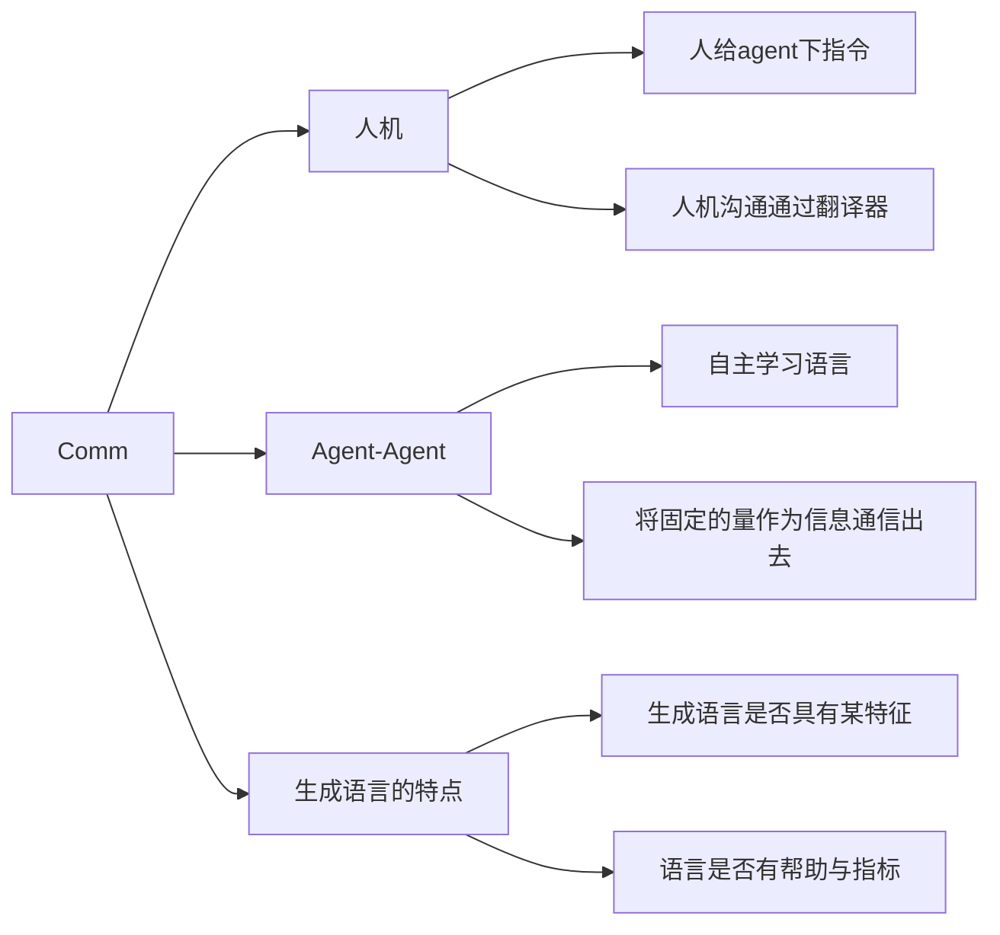

通信在MAS系统中是至关重要的。MARL的MAS系统中，每个独立的智能体个体都是一个RL agent。在他们的RL训练过程中，如果引入通信的辅助，往往会提升学习的效果。

对于MARL系统来讲，智能体之间的通信还会影响整体系统组织架构。

因此，我将所有这些文献的改进方向分为三类：

1. 提出了LLMaAC算法，基于LLM的AC算法。每个智能体都是LLM Agent，接收环境和Critic的建议，可以执行建议或更新建议直到建议能够被接受；Critic分为大的和小的，若干个小的critic各负责一部分，大的Critic负责汇总并发送给每个Actor。这个过程明显通信的辅助发生在AC通信中。C对A的通信协助提升了RL的动作选择（策略提升）。通过在C和A之间建立“助手”的方式改变CA交流的传统。沟通方式是通过大语言模型的自然语言。A有机会向C提出质询；C对A提供建议。属于机机通信中的主从之间通信，属于类别2.2
2. 提出了Task-language，代替NL作为人给RL下指令的通信协议。每个RL agent除了对state的评估之外，还根据tl指令选择自己的更新策略，属于类别1.2。人说出（无限制的）自由语言，翻译为agent能理解的tl。agent再将动作tl翻译为自然语言返回给人类。通过生成模型训练翻译器。（来自南大俞扬，relate work有人类指令相关工作。人类对agent指令是多智能体通信的重要一环）
3. 跟通信没有关系
4. COPA算法，主从结构，主面对数量随机变化的从学会合适、如何和他们沟通。属于类别2.2
5. 也跟通信没有什么关系，它是以人类为中心的强化学习，具体实现方法是从过往人类游戏中提取人类的目标，再训练让AI也学会人类的目标，并没有执行过程中人类和AI的通信。不过我觉得可以加上这部分，尝试人类将自己的目标意图传递给AI，并实时训练以人类为中心。
6. 联邦学习，不仅和通信无关，我觉得对于RL也是极为没有意义的。不过多智能体通信的拜占庭问题确实值得考虑。信息传输的攻击是否会对多智能体通信产生影响以及如何处理。
7. RLHF，不解释
8. 人大高瓴ReHAC，和通信无关，通过人类反馈学习LLM Agent的奖励函数和优势函数罢了。
9. 与通信无关，HSP，对self-play的魔改，对奖励模型加入了人类偏好，直观的说，在优化策略博弈的时候，其中一个策略的优化目标是那个隐藏的奖励模型
10. 没啥用
11. 也是AI-human对齐，没啥用
12. 与通信擦边，该工作实现了一个多智能体系统的可解释性框架，允许人类通过自然语言问询的方式询问多智能体系统此时正在做什么，执行什么策略等。未来可以用来增强通讯的可解释性。属于类别1.1
13. （introduction部分有需要阅读的）对于人机交流过程中，AI完全依赖人类的指令进行行为，AI应该能够学会根据指令提出这个指令是否清晰以及对不清晰的提出问题。在生成澄清问题的时候，由于数据集缺乏等问题可能无法生成，本工作提出了一种数据集，和数据收集方法。增强人机交互的用户体验，属于类别1.1. （引文有需要看的）贡献：
    + 一种工具，收集一个环境中的交互式基础语言指令
    + 一种数据集，人对人的语言指令数据集
    + 预测澄清问题的baseline
14. 对优化目标的修改，没用通信
15. 和通信关系不大，只是关注预测人类的reward model， 通过empowerment
16. 和通信关系不大，通过虚拟和组合解决zero-shot问题。
17. 授予AI在大规模合作中，以自然语言沟通的能力。该方法训练出来的智能体，能够具备更高的zero-shot能力，并且能使用人类的自然语言沟通。实现方式挺无聊的：首先使用类似PSRO的方式训练meta的speaker和listener，然后使用人类自然语言的数据库进行微调。属于类别1.2和2.1
18. 智能体系统之间，使用符号库中的符号进行通信，其中符号本身没有定义。通信协议的形成方式：对策略网络进行梯度下降，策略网络接收其他所有智能体的通信，并输出自己的通信。属于类别2.1
19. 和通信无关
20. 和通信无关
21. 和通信无关
22. 和通信无关
23. 和通信无关
24. 有关
25. 有关
26. 有关
27. 有关
28. 有关
29. 有关，24-29均更新到树状图中
30. 和通信无关
31. 使用双向RNN作为通信渠道，通信信息是隐变量，隐变量用来做AC更新的梯度的一部分。谁的隐变量对梯度的影响大，谁的话语权就大。整体框架使用AC，每个智能体都有一套自己的AC，执行动作之前使用双向RNN进行通信。
32. 智能体通过预定义词表学习通信，学习完之后，通过聚类方法分析和人类词汇的对应关系，然后构成翻译器
33. 使用注意力机制选择是否进行通信，用双向LSTM作为通信的信道，其中的隐变量作为智能体动作网络的指导
34. 无关
35. 无关
36. 无关
37. 无关
38. 无关
39. 关系不大，这篇文章讲的是人机通过动作等非语言特征进行协作，动作相互适应
40. 无关
41. 无关
42. 有关，决定何时通信
43. 无关
44. 无关
45. 无关
46. 